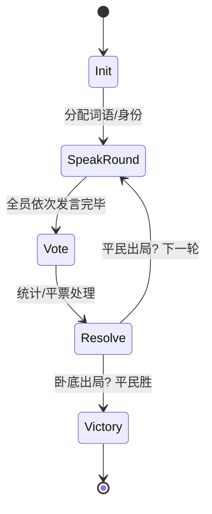
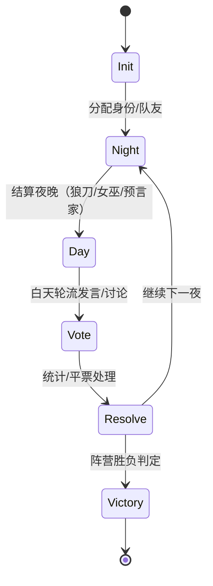

# 真人与 AI 社交游戏网站 — 设计与开发文档（Markdown 版）

> 技术栈：**Django + Django REST Framework + Channels (ASGI)**、**Vue 3 + Vite + Element Plus**、**WebSocket**、**OpenAI 兼容接口（流式）**、**Docker / Docker Compose**
> 首发游戏：**谁是卧底**、**狼人杀**（可扩展）

---

## 目录

* [1. 目标与范围](#1-目标与范围)
* [2. 架构总览](#2-架构总览)

  * [2.1 组件与职责](#21-组件与职责)
  * [2.2 通信方式](#22-通信方式)
  * [2.3 部署拓扑](#23-部署拓扑)
* [3. 数据库与模型设计](#3-数据库与模型设计)
* [4. 接口设计（REST & WebSocket）](#4-接口设计rest--websocket)

  * [4.1 REST API](#41-rest-api)
  * [4.2 WebSocket 消息协议](#42-websocket-消息协议)
* [5. 游戏引擎与状态机](#5-游戏引擎与状态机)

  * [5.1 通用引擎接口](#51-通用引擎接口)
  * [5.2 谁是卧底 — 状态机](#52-谁是卧底--状态机)
  * [5.3 狼人杀 — 状态机](#53-狼人杀--状态机)
* [6. AI 集成与提示词系统](#6-ai-集成与提示词系统)

  * [6.1 配置与调用（流式）](#61-配置与调用流式)
  * [6.2 提示词框架与上下文注入](#62-提示词框架与上下文注入)
  * [6.3 AI 风格（人格）系统](#63-ai-风格人格系统)
  * [6.4 合规与输出后处理](#64-合规与输出后处理)
* [7. 前端设计（Vue + Element Plus）](#7-前端设计vue--element-plus)

  * [7.1 信息架构与路由](#71-信息架构与路由)
  * [7.2 关键页面与组件](#72-关键页面与组件)
  * [7.3 响应式与扁平化样式约定](#73-响应式与扁平化样式约定)
* [8. 实时系统（Channels）](#8-实时系统channels)
* [9. Docker 部署方案](#9-docker-部署方案)
* [10. 安全性与可扩展性建议](#10-安全性与可扩展性建议)
* [11. 目录结构建议](#11-目录结构建议)
* [12. 开发里程碑与测试要点](#12-开发里程碑与测试要点)

---

## 1. 目标与范围

* 支持用户注册、登录、个人资料。
* 游戏大厅：创建房间、加入房间（房号）、设定最大人数。
* 游戏开始：房主点击“开始游戏”，**自动用 AI 补齐空位**；房主也可**手动添加 AI 并选择风格**。
* 实时文字聊天、轮流发言、投票、公示结果。
* AI 通过 **OpenAI 兼容接口** 流式输出，BaseURL/Key/Model 可在配置文件或环境变量设置。
* 良好扩展性：后续可扩展新游戏、新身份、新规则、新 AI 风格。
* 使用 **Docker** 容器化部署。

---

## 2. 架构总览

### 2.1 组件与职责

* **Frontend（Vue 3 + Vite + Element Plus）**

  * SPA（登录/注册、大厅、房间、游戏面板、聊天、投票）。
  * REST 调用（用户/房间 CRUD），WebSocket 订阅实时事件。
  * 显示 AI 流式发言、轮次控制、私密面板（仅自己可见的词/身份）。

* **Backend（Django + DRF + Channels, ASGI）**

  * REST API：鉴权、房间、玩家管理、游戏元数据。
  * WebSocket：房间组广播、聊天、轮次、投票、AI 流式中继。
  * 游戏引擎：抽象接口 + 各游戏子类（卧底、狼人杀）。
  * AI 模块：OpenAI 兼容流式调用、提示词拼装、人格风格注入、输出后处理。

* **DB（MySQL）**

  * 用户/房间/玩家/词库/角色配置/日志（可选）。

* **Nginx（可选）**

  * 前端静态资源托管、反向代理 HTTP 与 WebSocket。

### 2.2 通信方式

* **REST (HTTPS)**：登录注册、房间创建/列表、进入/退出房间、历史记录等。
* **WebSocket (WSS)**：聊天室消息、系统广播、阶段切换、投票进度、AI 流式文本增量。

### 2.3 部署拓扑

```text
[ Browser (Vue SPA) ]
        |  HTTPS + WSS
[ Nginx Reverse Proxy ]
        |--> /api  -> Django (Gunicorn + Uvicorn/ASGI)
        |--> /ws   -> Django Channels (ASGI)
        |--> /     -> Static (built Vue)
[ Django + Channels ] --(ORM)--> [ MySQL ]
                          |
                          +--(HTTP)--> [ OpenAI-Compatible API ]
```

---

## 3. 数据库与模型设计

> 使用 Django ORM，数据库使用MySQL。

**User（扩展或直接用 Django User）**

* `username`, `email`, `password_hash`
* `profile`：头像、昵称、积分（可选）

**GameRoom**

* `id`（房号字符串/短码）
* `game_type`：`undercover` / `werewolf`
* `status`：`waiting` | `running` | `ended`
* `owner`（FK -> User）
* `max_players`（int）
* `current_round`（int）
* `phase`（字符串，如 `speak`/`vote`/`night`/`day`）
* `config`（JSON：如狼人配置、时间限制）
* `created_at`, `updated_at`

**Player**

* `room`（FK -> GameRoom）
* `user`（FK -> User，可为空表示 AI）
* `nickname`（展示名）
* `is_ai`（bool）
* `ai_style`（枚举：`calm`/`aggressive`/`cautious`/`humorous` 等）
* `seat_no`（座位/发言顺序）
* `alive`（bool）
* **卧底字段**：`word`（词语），`is_undercover`（bool 或通过词对判定）
* **狼人杀字段**：`role`（`wolf`/`villager`/`seer`/`witch`...），`team`（`wolf`/`good`）
* `private_state`（JSON：如女巫药剂剩余、预言家查验结果缓存）

**UndercoverWordPair**

* `civilian_word`（文本）
* `undercover_word`（文本）
* `category`（可选）

**GameLog（可选）**

* `room`、`event_type`、`payload`（JSON）、`created_at`

> 聊天消息可不持久化，或按需落库审计。

---

## 4. 接口设计（REST & WebSocket）

### 4.1 REST API

* **Auth**

  * `POST /api/auth/register`：`{username, email, password}`
  * `POST /api/auth/login`：`{username, password}` → JWT / Cookie
  * `POST /api/auth/logout`

* **Room**

  * `GET  /api/rooms?game_type=&status=`：列表
  * `POST /api/rooms`：创建 `{game_type, max_players, name?}`
  * `GET  /api/rooms/{room_id}`：详情
  * `POST /api/rooms/{room_id}/join`：加入（可附 `nickname`）
  * `POST /api/rooms/{room_id}/leave`
  * `POST /api/rooms/{room_id}/start`：房主开始（自动 AI 补位）
  * `POST /api/rooms/{room_id}/add-ai`：房主手动添加 AI `{style}`

* **Meta**

  * `GET /api/meta/ai-styles`：AI 风格列表
  * `GET /api/meta/undercover-word-pairs?limit=...`（管理用途）

> 身份/词语等私密信息通过 **WS 私信** 或 REST 私有端点返回（仅本人可见）。

### 4.2 WebSocket 消息协议

> 房间级频道：`wss://.../ws/rooms/{room_id}`
> 鉴权：连接时携带 JWT/Cookie，后端校验并加入 group。

**统一消息格式**

```json
{
  "type": "event",            // event | chat | system | control | stream
  "subtype": "speak|vote|...",// 可细化
  "sender": "player_id|system|ai_x",
  "payload": { ... },         // 事件数据
  "ts": 1730000000
}
```

**典型消息**

* 聊天消息（轮到发言/自由讨论）：

  ```json
  { "type": "chat", "sender": "p_12", "payload": { "text": "..." } }
  ```

* 阶段切换：

  ```json
  { "type": "system", "subtype": "phase_change", "payload": { "phase": "vote", "round": 2 } }
  ```

* 投票提交（客户端→服务器）：

  ```json
  { "type": "event", "subtype": "vote", "payload": { "target": "p_07" } }
  ```

* AI 流式输出（服务器→客户端，多次）：

  ```json
  { "type": "stream", "subtype": "ai_chunk", "sender": "ai_03", "payload": { "delta": "片段文本" } }
  ```

  结束：

  ```json
  { "type": "stream", "subtype": "ai_end", "sender": "ai_03" }
  ```

---

## 5. 游戏引擎与状态机

### 5.1 通用引擎接口

```python
class BaseGameEngine:
    game_type: str

    def start_game(self, room: GameRoom): ...
    def handle_action(self, room: GameRoom, player: Player, action: dict): ...
    def next_phase(self, room: GameRoom): ...
    def ai_act(self, room: GameRoom, ai_player: Player, context: dict): ...
    def check_victory(self, room: GameRoom) -> dict|None: ...
```

> 每种游戏实现自己的子类：`UndercoverEngine`、`WerewolfEngine`。

### 5.2 谁是卧底 — 状态机



* **事件**：`speak(player,text)`、`vote(player,target)`、`tiebreak(extra_speak)`
* **胜负**：卧底出局 → 平民胜；或剩余人数到阈值卧底胜。

### 5.3 狼人杀 — 状态机



* **夜晚顺序**：狼人 → 预言家 → 女巫（可自定义）
* **胜负**：狼全出局 → 好人胜；存活狼数 ≥ 存活好人数 → 狼胜。

---

## 6. AI 集成与提示词系统

### 6.1 配置与调用（流式）

`.env`（示例）

```bash
OPENAI_API_BASE=https://your-compatible-api/v1
OPENAI_API_KEY=sk-xxxx
OPENAI_MODEL=gpt-4o-mini
```

Python 伪代码（后端中继流式→WS）：

```python
def stream_ai(room_id, ai_player, messages):
    with requests.post(
        f"{BASE}/chat/completions",
        headers={"Authorization": f"Bearer {KEY}"},
        json={"model": MODEL, "messages": messages, "stream": True},
        stream=True, timeout=60
    ) as r:
        for chunk in iter_sse_chunks(r):
            delta = extract_delta(chunk)
            channels.group_send(room_group(room_id), {
                "type": "ws.stream",
                "sender": f"ai_{ai_player.id}",
                "payload": {"delta": delta}
            })
        channels.group_send(room_group(room_id), {"type": "ws.stream_end", "sender": f"ai_{ai_player.id}"})
```

> **安全**：仅后端持有密钥；前端不直连 AI 服务。

### 6.2 提示词框架与上下文注入

> **分层**：`system`（规则/人格/禁令） + `developer`（可选，代码级约束） + `user`（当前回合任务）
> **按阶段切换模板**；**上下文**注入：己方词/身份、历史发言摘要、投票记录、夜间信息（仅本人）。

**谁是卧底**

* `system`（开局——每个 AI）

  ```
  你在玩“谁是卧底”。你只知道自己的词语：{my_word}。
  可能存在少数玩家词语不同但相关（他们是卧底）。目标：
  - 若你与大多数玩家同词：通过“含蓄描述”揪出卧底。
  - 若你的词不同：隐藏自己，避免被票出。
  规则：发言用一句话，不直接透露词语；不暴露他人/自己词面。
  你的说话风格：{style_desc}。
  ```
* `user`（发言阶段）

  ```
  第 {round} 轮描述。已发言摘要：
  {history_brief}
  请用一句话描述你的词的特征（含蓄、贴近真实、不泄露词面）。
  ```
* `user`（投票阶段）

  ```
  请从当前存活玩家中选择一位你认为是卧底的玩家编号，并给出一句理由。
  玩家列表：{alive_list}
  历史摘要：{history_brief}
  ```
* `user`（平票加时）

  ```
  你处于被怀疑名单内。请追加一句话为自己辩护或进一步描述（仍不得暴露词面）。
  ```

**狼人杀**

* `system`（开局——每个 AI）

  ```
  你在玩“狼人杀”。你的角色：{role}（阵营：{team}）。
  夜晚保密，白天讨论投票。请遵守身份信息保密，除非策略需要。
  你的说话风格：{style_desc}。
  ```

* 夜晚：

  * 狼人：

    ```
    天黑。你是狼人。存活玩家：{alive_list}。队友：{wolfmates}.
    请选择今晚要击杀的目标编号（仅返回编号，不要解释）。
    ```
  * 预言家：

    ```
    天黑。你是预言家。选择一名玩家进行查验（仅返回编号）。
    ```

    *系统随后私密注入*：「你查验了 X 号，结果：{is_wolf/不是狼}」
  * 女巫：

    ```
    天黑。被杀目标：{victim_or_none}。你的解药（{remain_heal}次）、毒药（{remain_poison}次）。
    请回复：是否救人（救/不救）与是否毒杀谁（编号/不毒）。
    ```

* 白天发言：

  ```
  第 {day} 天 白天。昨夜结果：{night_result_brief}。
  发言顺序到你。历史发言摘要：{history_brief}。
  请基于你的身份与信息进行陈述（可分析/可带节奏但避免直露夜晚机密）。
  ```

* 投票：

  ```
  进入投票，请返回你投票的玩家编号，并一句话说明理由。
  ```

> **提示**：多套近义模板轮换，减少重复。

### 6.3 AI 风格（人格）系统

* 预置风格与描述：

  * `calm`: 冷静理智型，「条理清晰、语气平和、注重证据」
  * `aggressive`: 激进好斗型，「语气强硬、频繁质疑、敢于带节奏」
  * `cautious`: 犹豫谨慎型，「保守、模糊措辞、避免强烈表态」
  * `humorous`: 诙谐幽默型，「轻松风趣、用比喻调侃但不跑题」
* 注入：在 `system` 末尾加 `你的说话风格：{style_desc}`。
* **房主手动添加 AI** 时可选风格；**自动补齐** 随机分配。

### 6.4 合规与输出后处理

* **词面泄露检查**（卧底）：若检测到本方词语字面出现 → 截断/重生。
* **越权信息**（狼人杀）：禁止直接泄露夜晚隐私（除非策略允许的诈身份）。
* **内容安全**：关键词过滤/平台审核 API；对不当内容替换与告警。

---

## 7. 前端设计（Vue + Element Plus）

### 7.1 信息架构与路由

```
/login
/register
/lobby                 # 大厅：房间列表、创建房间、按房号加入
/room/:id              # 房间/游戏页（根据 game_type 渲染对应面板）
```

### 7.2 关键页面与组件

* **全局**

  * `AppHeader`（用户信息/登出）
  * `AppToaster`（全局通知）
* **大厅**

  * `RoomList`（筛选/分页/状态标签）
  * `CreateRoomDialog`
  * `JoinByCode`（房号输入）
* **房间页**

  * `PlayerList`（真人/AI、存活状态、房主标识）
  * `ChatPanel`（系统消息、发言、AI 流式）
  * `ControlBar`（房主：开始/结束、添加 AI）
  * `GamePanelSwitcher`

    * `UndercoverPanel`（显示“我的词语”、轮次、投票 UI）
    * `WerewolfPanel`（显示“我的身份”、夜/昼操作、投票 UI）
  * `VoteDialog`（通用投票弹窗）
  * `NightOverlay` / `DayOverlay`（动画转场）

### 7.3 响应式与扁平化样式约定

* **布局**：Grid/Flex，自适应两栏（≥1024px）/单栏（<1024px）。
* **色板**：中性底+强调色（如蓝/紫）；狼人夜晚可加深色背景层。
* **扁平化**：少阴影、多留白、明确的主次层级；按钮/标签色差明显。
* **可用性**：投票按钮与当前阶段强关联（非阶段禁用/隐藏）。

---

## 8. 实时系统（Channels）

* **连接**：用户进入房间页，前端 `ws = new WebSocket('/ws/rooms/{id}')`。
* **Consumer**：

  * `connect()`：校验用户是否在该房间 → `group_add(room_{id})`
  * `receive_json()`：转发给 `GameEngine.handle_action(...)`
  * `group_send()`：广播 `chat/system/stream/phase` 等消息
* **顺序控制**：轮流发言时，后端校验 `current_speaker == player`；非轮到消息直接忽略/回错误。
* **扩展**：高并发使用 Redis Channel Layer。

---

## 9. Docker 部署方案

**目录：**

```
/deploy
  ├─ docker-compose.yml
  ├─ backend.Dockerfile
  ├─ frontend.Dockerfile (可选，通常仅构建)
  └─ nginx.conf
```

**docker-compose.yml（示例）**

```yaml
version: "3.9"
services:
  db:
    image: mysql
    environment:
      MYSQL_USER: game
      MYSQL_PASSWORD: gamepwd
      MYSQL_DB: game_db
    volumes:
      - dbdata:/var/lib/mysql/data
  backend:
    build:
      context: ..
      dockerfile: deploy/backend.Dockerfile
    env_file:
      - ../.env
    depends_on: [db]
  nginx:
    image: nginx:alpine
    volumes:
      - ../frontend/dist:/usr/share/nginx/html
      - ./nginx.conf:/etc/nginx/nginx.conf
    ports: ["80:80"]
    depends_on: [backend]
volumes:
  dbdata:
```

**后端 Dockerfile（示例）**

```dockerfile
FROM python:3.11-slim
WORKDIR /app
COPY backend/requirements.txt .
RUN pip install -r requirements.txt
COPY backend .
ENV DJANGO_SETTINGS_MODULE=config.settings
CMD ["bash", "-lc", "python manage.py migrate && daphne -b 0.0.0.0 -p 8000 config.asgi:application"]
```

**Nginx 反代（片段）**

```nginx
upstream django {
  server backend:8000;
}

server {
  listen 80;
  location /api/ { proxy_pass http://django; }
  location /ws/  {
    proxy_pass http://django;
    proxy_http_version 1.1;
    proxy_set_header Upgrade $http_upgrade;
    proxy_set_header Connection "upgrade";
  }
  location / { root /usr/share/nginx/html; try_files $uri /index.html; }
}
```

---

## 10. 安全性与可扩展性建议

* **鉴权**：JWT/Cookie + CSRF 防护（若使用 Cookie）。
* **WS 鉴权**：握手校验用户与房间绑定；非成员拒绝。
* **权限**：后端强校验（房主操作、角色夜间操作）。
* **数据校验**：投票对象必须为存活玩家。
* **信息最小化**：只向对应玩家下发私密信息（词/身份/夜晚结果）。
* **内容安全**：AI 输出关键词过滤；异常上报（Sentry）。
* **可扩展**：

  * Channels 使用 Redis Layer → 多实例水平扩展。
  * 将 AI 调用抽象成服务，必要时独立 worker（Celery/队列）。
  * 游戏引擎按 `BaseGameEngine` 扩展新游戏/新身份。

---

## 11. 目录结构建议

```
/backend
  ├─ config/                 # Django/ASGI/Channels 设置
  ├─ apps/
  │   ├─ users/              # 注册登录/资料
  │   ├─ rooms/              # 房间/玩家/REST
  │   ├─ gamecore/           # 引擎基类 + 公共工具
  │   ├─ games/
  │   │   ├─ undercover/     # 卧底引擎/提示词/词库管理
  │   │   └─ werewolf/       # 狼人引擎/提示词/角色配置
  │   └─ ai/                 # AI 流式调用与后处理
  ├─ requirements.txt
  └─ manage.py

/frontend
  ├─ src/
  │   ├─ main.ts
  │   ├─ router/
  │   ├─ store/
  │   ├─ api/                # REST 封装
  │   ├─ ws/                 # WS 客户端
  │   ├─ components/
  │   ├─ views/
  │   │   ├─ Login.vue
  │   │   ├─ Lobby.vue
  │   │   └─ Room.vue
  │   └─ gamepanels/
  │       ├─ UndercoverPanel.vue
  │       └─ WerewolfPanel.vue
  └─ vite.config.ts
```

---

## 12. 开发里程碑与测试要点

**M1：基础框架**

* Django + DRF + Channels 基础就绪；Vue3 + Element Plus 初始化。
* Auth 流程（注册/登录/鉴权）完成；Docker 本地跑通。

**M2：房间与聊天**

* 房间 CRUD、加入/退出；WS 群组通信；聊天广播。
* 大厅实时刷新（轮询/WS）。

**M3：谁是卧底**

* 词库、分配词语、轮流发言、投票/平票处理、胜负判定。
* AI 接入（发言/投票），风格注入，流式输出。

**M4：狼人杀（精简版）**

* 角色分配（狼/民/预言/女巫）、夜晚结算、白天发言、投票。
* 私密频道（夜晚私密消息）、AI 夜间行动建议与执行。

**M5：打磨与扩展**

* UI 动效（昼夜切换、投票揭晓）。
* 日志/监控、异常处理、内容安全。
* 压测与扩容策略；文档与管理后台。

**测试要点**

* **并发**：多房间并行，WS 订阅与消息顺序一致性。
* **权限**：非当前阶段/非当前发言者消息被拒。
* **AI**：流式稳定性、超时重试、风格差异度、泄密检测。
* **安全**：只向本人下发私密信息；恶意报文不扰乱状态机。

---

> 以上文档为可直接落地的设计与开发指南：涵盖架构、数据、接口、状态机、AI 提示词、前端模块、实时通信与部署落地细节。按本方案实施，可交付一个**功能齐全、体验精美、可持续扩展**的真人 + AI 社交游戏平台。
