# 项目结构

本文档旨在详细描述 AI 社交游戏项目的前后端文件结构，并解释每个关键文件的作用。

## 文件结构图

```mermaid
graph TD
    A[AISocialGame] --> B[backend];
    A --> C[frontend];
    A --> D[doc];
    A --> E[.gitignore];
    A --> F[docker-compose.yml];
    A --> G[README.md];

    B --> B1[src];
    B --> B2[pom.xml];
    B --> B3[Dockerfile];
    B1 --> B1a[main/java/com/aisocialgame/backend];
    B1a --> B1a1[AiSocialGameApplication.java];
    B1a --> B1a2[config];
    B1a --> B1a3[controller];
    B1a --> B1a4[dto];
    B1a --> B1a5[entity];
    B1a --> B1a6[realtime];
    B1a --> B1a7[repository];
    B1a --> B1a8[security];
    B1a --> B1a9[service];
    B1a2 --> B1a2a[AppProperties.java];
    B1a2 --> B1a2b[JwtProperties.java];
    B1a2 --> B1a2c[RequestLoggingFilter.java];
    B1a2 --> B1a2d[SecurityConfig.java];
    B1a3 --> B1a3a[AuthController.java];
    B1a3 --> B1a3b[GlobalExceptionHandler.java];
    B1a3 --> B1a3c[MetaController.java];
    B1a3 --> B1a3d[RoomController.java];
    B1a3 --> B1a3e[WordPairController.java];
    B1a4 --> B1a4a[AuthDtos.java];
    B1a4 --> B1a4b[MetaDtos.java];
    B1a4 --> B1a4c[RoomDtos.java];
    B1a4 --> B1a4d[WordPairDtos.java];
    B1a5 --> B1a5a[GameSession.java];
    B1a5 --> B1a5b[RefreshToken.java];
    B1a5 --> B1a5c[Room.java];
    B1a5 --> B1a5d[RoomPlayer.java];
    B1a5 --> B1a5e[UserAccount.java];
    B1a5 --> B1a5f[WordPair.java];
    B1a6 --> B1a6a[RealtimeWebSocketConfig.java];
    B1a6 --> B1a6b[RoomRealtimeEvents.java];
    B1a6 --> B1a6c[RoomRealtimeListener.java];
    B1a6 --> B1a6d[RoomSocketCoordinator.java];
    B1a6 --> B1a6e[RoomSocketHandler.java];
    B1a6 --> B1a6f[WebSocketAccessTokenInterceptor.java];
    B1a7 --> B1a7a[GameSessionRepository.java];
    B1a7 --> B1a7b[RefreshTokenRepository.java];
    B1a7 --> B1a7c[RoomPlayerRepository.java];
    B1a7 --> B1a7d[RoomRepository.java];
    B1a7 --> B1a7e[UserRepository.java];
    B1a7 --> B1a7f[WordPairRepository.java];
    B1a8 --> B1a8a[AccountUserDetails.java];
    B1a8 --> B1a8b[AccountUserDetailsService.java];
    B1a8 --> B1a8c[JwtAuthenticationFilter.java];
    B1a8 --> B1a8d[JwtService.java];
    B1a9 --> B1a9a[AuthService.java];
    B1a9 --> B1a9b[JsonUtils.java];
    B1a9 --> B1a9c[RoomService.java];
    B1a9 --> B1a9d[UserService.java];
    B1a9 --> B1a9e[WordPairService.java];

    C --> C1[src];
    C --> C2[public];
    C --> C3[package.json];
    C --> C4[vite.config.ts];
    C --> C5[Dockerfile.dev];
    C1 --> C1a[App.vue];
    C1 --> C1b[main.ts];
    C1 --> C1c[api];
    C1 --> C1d[components];
    C1 --> C1e[i18n];
    C1 --> C1f[pages];
    C1 --> C1g[router];
    C1 --> C1h[services];
    C1 --> C1i[store];
    C1 --> C1j[styles];
    C1 --> C1k[types];
    C1c --> C1c1[auth.ts];
    C1c --> C1c2[http.ts];
    C1c --> C1c3[meta.ts];
    C1c --> C1c4[rooms.ts];
    C1c --> C1c5[user.ts];
    C1c --> C1c6[wordPairs.ts];
    C1d --> C1d1[GlobalNotifications.vue];
    C1d --> C1d2[SpeechTimeline.vue];
    C1e --> C1e1[index.ts];
    C1e --> C1e2[messages.ts];
    C1f --> C1f1[LobbyPage.vue];
    C1f --> C1f2[LoginPage.vue];
    C1f --> C1f3[RegisterPage.vue];
    C1f --> C1f4[RoomPage.vue];
    C1f --> C1f5[StatsPage.vue];
    C1f --> C1f6[WordBankAdminPage.vue];
    C1g --> C1g1[index.ts];
    C1h --> C1h1[notifications.ts];
    C1h --> C1h2[realtime.ts];
    C1i --> C1i1[index.ts];
    C1i --> C1i2[meta.ts];
    C1i --> C1i3[notifications.ts];
    C1i --> C1i4[rooms.ts];
    C1i --> C1i5[user.ts];
    C1j --> C1j1[global.scss];
    C1k --> C1k1[rooms.ts];
    C1k --> C1k2[user.ts];
    C1k --> C1k3[word-pairs.ts];
```

## 根目录文件

- **.gitignore**: 指定 Git 版本控制系统需要忽略的文件和目录。
- **docker-compose.yml**: 定义和运行多容器 Docker 应用程序的工具。
- **README.md**: 项目的说明文件，提供项目概览、安装和使用指南。

## Backend (后端)

后端采用 Java 和 Spring Boot 框架开发。

- **pom.xml**: Maven 项目对象模型文件，定义了项目的依赖、插件和构建配置。
- **Dockerfile**: 用于构建后端 Docker 镜像的配置文件。

### `src/main/java/com/aisocialgame/backend`

#### `AiSocialGameApplication.java`
- **作用**: Spring Boot 应用程序的主入口点，负责启动整个后端服务。

#### `config` (配置)
- **AppProperties.java**: 定义应用程序级别的配置属性。
- **JwtProperties.java**: 专门用于配置 JWT（JSON Web Token）相关的属性，如密钥、过期时间等。
- **RequestLoggingFilter.java**: 一个过滤器，用于记录传入的 HTTP 请求，方便调试。
- **SecurityConfig.java**: Spring Security 的核心配置文件，定义了安全策略，如认证、授权、CORS 等。

#### `controller` (控制器)
- **AuthController.java**: 处理用户认证相关的 API 请求，如登录、注册、刷新 token。
- **GlobalExceptionHandler.java**: 全局异常处理器，捕获并处理整个应用程序中的异常，返回统一的错误响应。
- **MetaController.java**: 提供元数据相关的 API，如获取应用版本信息。
- **RoomController.java**: 处理游戏房间相关的 API 请求，如创建、加入、离开房间。
- **WordPairController.java**: 管理词汇对的 API，用于游戏内容的管理。

#### `dto` (数据传输对象)
- **AuthDtos.java**: 定义用于认证流程的数据传输对象。
- **MetaDtos.java**: 定义元数据相关的 DTO。
- **RoomDtos.java**: 定义游戏房间相关的 DTO。
- **WordPairDtos.java**: 定义词汇对相关的 DTO。

#### `entity` (实体)
- **GameSession.java**: 表示一局游戏会话的实体。
- **RefreshToken.java**: 存储刷新 token 的实体，用于实现持久化登录。
- **Room.java**: 游戏房间的实体。
- **RoomPlayer.java**: 房间内玩家的实体。
- **UserAccount.java**: 用户账户的实体。
- **WordPair.java**: 词汇对的实体。

#### `realtime` (实时通信)
- **RealtimeWebSocketConfig.java**: 配置 WebSocket，启用实时通信功能。
- **RoomRealtimeEvents.java**: 定义房间内发生的实时事件类型。
- **RoomRealtimeListener.java**: 监听并处理来自客户端的 WebSocket 消息。
- **RoomSocketCoordinator.java**: 协调房间内的 WebSocket 通信，管理消息的分发。
- **RoomSocketHandler.java**: WebSocket 的核心处理器，处理连接、消息和断开连接等事件。
- **WebSocketAccessTokenInterceptor.java**: WebSocket 连接的拦截器，用于验证 access token。

#### `repository` (数据仓库)
- **GameSessionRepository.java**: 提供对 `GameSession` 实体的数据库操作。
- **RefreshTokenRepository.java**: 提供对 `RefreshToken` 实体的数据库操作。
- **RoomPlayerRepository.java**: 提供对 `RoomPlayer` 实体的数据库操作。
- **RoomRepository.java**: 提供对 `Room` 实体的数据库操作。
- **UserRepository.java**: 提供对 `UserAccount` 实体的数据库操作。
- **WordPairRepository.java**: 提供对 `WordPair` 实体的数据库操作。

#### `security` (安全)
- **AccountUserDetails.java**: 实现了 Spring Security 的 `UserDetails` 接口，封装了用户账户信息。
- **AccountUserDetailsService.java**: 实现了 `UserDetailsService` 接口，用于从数据库加载用户信息。
- **JwtAuthenticationFilter.java**: JWT 认证过滤器，在每个请求中验证 JWT 的有效性。
- **JwtService.java**: 提供生成和验证 JWT 的服务。

#### `service` (服务)
- **AuthService.java**: 处理认证相关的业务逻辑。
- **JsonUtils.java**: 提供 JSON 序列化和反序列化的工具类。
- **RoomService.java**: 处理游戏房间相关的业务逻辑。
- **UserService.java**: 处理用户相关的业务逻辑。
- **WordPairService.java**: 处理词汇对相关的业务逻辑。

## Frontend (前端)

前端采用 Vue 3, TypeScript 和 Vite 构建。

- **package.json**: 定义了项目的依赖、脚本和元数据。
- **vite.config.ts**: Vite 构建工具的配置文件。
- **Dockerfile.dev**: 用于开发环境的前端 Docker 镜像配置文件。
- **index.html**: 单页面应用（SPA）的入口 HTML 文件。

### `src`

- **App.vue**: Vue 应用的根组件。
- **main.ts**: 应用的入口文件，负责初始化 Vue 实例、路由、状态管理等。

#### `api`
- **auth.ts**: 封装了与认证相关的 API 请求。
- **http.ts**: 封装了 `axios` 实例，提供了统一的 HTTP 请求处理，包括拦截器等。
- **meta.ts**: 封装了获取元数据的 API 请求。
- **rooms.ts**: 封装了与游戏房间相关的 API 请求。
- **user.ts**: 封装了与用户相关的 API 请求。
- **wordPairs.ts**: 封装了与词汇对相关的 API 请求。

#### `components`
- **GlobalNotifications.vue**: 全局通知组件，用于向用户显示提示信息。
- **SpeechTimeline.vue**: 发言时间线组件，用于在游戏房间中展示玩家的发言记录。

#### `i18n` (国际化)
- **index.ts**: 初始化 `vue-i18n` 实例。
- **messages.ts**: 定义了多语言的文本消息。

#### `pages` (页面)
- **LobbyPage.vue**: 游戏大厅页面，显示可用的游戏房间。
- **LoginPage.vue**: 用户登录页面。
- **RegisterPage.vue**: 用户注册页面。
- **RoomPage.vue**: 游戏房间页面，是游戏进行的核心界面。
- **StatsPage.vue**: 统计页面，展示用户的游戏数据。
- **WordBankAdminPage.vue**: 词汇库管理页面，用于管理游戏词汇。

#### `router` (路由)
- **index.ts**: 配置应用的路由规则，将 URL 映射到对应的页面组件。

#### `services` (服务)
- **notifications.ts**: 管理全局通知的服务。
- **realtime.ts**: 封装了 WebSocket 客户端逻辑，处理实时通信。

#### `store` (状态管理)
- **index.ts**: 初始化 Pinia 状态管理。
- **meta.ts**: 管理元数据相关的状态。
- **notifications.ts**: 管理通知相关的状态。
- **rooms.ts**: 管理游戏房间相关的状态。
- **user.ts**: 管理用户认证和信息的全局状态。

#### `styles`
- **global.scss**: 全局 SCSS 样式文件。

#### `types` (类型定义)
- **rooms.ts**: 定义游戏房间相关的数据类型。
- **user.ts**: 定义用户相关的数据类型。
- **word-pairs.ts**: 定义词汇对相关的数据类型。